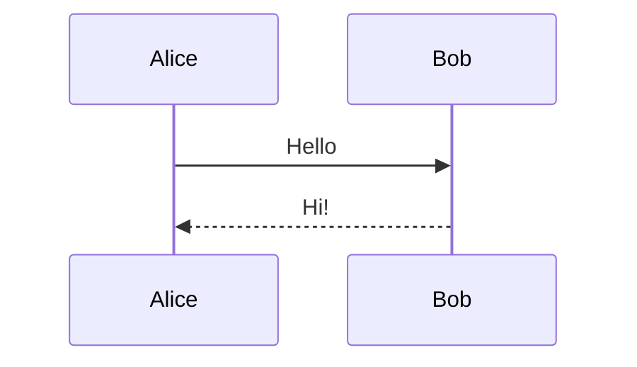

<p align="center">
  
</p>

# VueMarkdownRenderer

A **config-driven**, high-performance Markdown renderer for Vue, designed for **LLM streaming**, **rich code blocks**, and **embedded visual components**.

[live demo](https://linzhe141.github.io/vue-markdown-renderer/)

---

## Core Idea

Unlike traditional Markdown components that rely on many reactive props,
**VueMarkdownRenderer uses a single static configuration to define rendering behavior**.

```ts
const MarkdownRenderer = createMarkdownRenderer(config);
```

- Rendering capabilities are defined **once**
- The returned renderer component is **pure and predictable**
- Avoids the mental overhead of “is this prop reactive?”

This design is intentional:
**99% of Markdown rendering scenarios do not require runtime mutation of render rules.**

---

## Installation

```bash
npm install vue-mdr
```

---

## Basic Usage

```ts
import { createMarkdownRenderer } from "vue-mdr";
```

```ts
export const MarkdownRenderer = createMarkdownRenderer({
  // configuration here
});
```

```vue
<template>
  <MarkdownRenderer :source="markdownText" theme="light" />
</template>
```

---

## Full Configuration Example

Below is a **complete example** matching the latest API design.

```ts
import { createMarkdownRenderer } from "vue-mdr";

import "katex/dist/katex.min.css";
import remarkMath from "remark-math";
import rehypeKatex from "rehype-katex";
import type { Plugin } from "unified";

import {
  BarChart,
  CodeBlockRenderer,
  MermaidRenderer,
  EchartRenderer,
  Placeholder,
} from "./components";

export const MarkdownRenderer = createMarkdownRenderer({
  renderers: {
    /**
     * Custom hast tag -> Vue component renderers.
     * The original hast node is available on `props.node`.
     */
    nodes: {
      a: ARenderer,
      img: ImageRenderer,
    },
    /**
     * Custom Vue components rendered via `component-json` blocks
     */
    components: {
      BarChart,
      Placeholder,
    },
    codeBlock: CodeBlockRenderer,
    echart: {
      renderer: EchartRenderer,
      placeholder: Placeholder,
    },
    mermaid: MermaidRenderer,
  },
  plugins: {
    remark: [remarkMath],
    rehype: [rehypeKatex as unknown as Plugin],
  },
  processor: {
    remarkRehype: {
      allowDangerousHtml: true,
    },
    sanitizeSchema: {
      attributes: {
        "*": ["className", "style"],
      },
    },
  },
});
```

---

## Design Philosophy

### 1. Static Configuration over Reactive Props

```ts
createMarkdownRenderer({
  renderers: {
    mermaid: renderer,
    echart: { renderer },
    codeBlock: renderer,
  },
});
```

- No runtime mutation
- No watchers
- No ambiguous reactivity expectations

> The renderer is **configured**, not **controlled**.

---

### 2. Capability-based Rendering

Each feature is **opt-in**:

| Feature             | Config Key                             |
| ------------------- | -------------------------------------- |
| Code blocks         | `renderers.codeBlock`                  |
| Mermaid             | `renderers.mermaid`                    |
| ECharts             | `renderers.echart`                     |
| HAST node renderers | `renderers.nodes`                      |
| Vue components      | `renderers.components`                 |
| LaTeX               | `plugins.remark` / `plugins.rehype`    |
| Processor internals | `processor.remarkRehype/sanitizeSchema` |

If you don’t configure it, it doesn’t exist.

---

## Custom Code Block Rendering

Your `CodeBlockRenderer` receives:

```ts
interface Props {
  highlightVnode: VNode;
  language: string;
}
```

This allows you to implement:

- Copy buttons
- Language labels
- Custom headers
- Animations
- Streaming-friendly UI

```ts
renderers: {
  codeBlock: CodeBlockRenderer,
}
```

---

## Rendering Vue Components (`component-json`)

````markdown
```component-json {"placeholder": "Placeholder"}
{
  "type": "BarChart",
  "props": {
    "chartData": {
      "categories": ["A", "B", "C"],
      "seriesData": [10, 20, 30]
    }
  }
}
```
````

```component-json {"placeholder": "Placeholder"}
{"type":"BarChart","props":{"chartData":{"categories":["type1","type2","type3","type4","type5","type6","type7","type8","type9","type10","type11","type12","type13","type14","type15","type16","type17","type18","type19","type20"],"seriesData":[100,200,150,180,120,130,170,160,190,210,220,140,125,155,165,175,185,195,205,215]}}}
```

## Rendering ECharts

````markdown
```echarts
{
  "title": {
    "text": "数据对比趋势变化",
    "left": "center"
  },
  "tooltip": {
    "trigger": "axis",
    "axisPointer": {
      "type": "cross",
      "crossStyle": { "color": "#999" }
    },
    "formatter": "{b}<br/>{a0}: {c0}"
  },
  "legend": {
    "data": ["本期"],
    "top": "bottom"
  },
  "grid": {
    "left": "3%",
    "right": "4%",
    "bottom": "10%",
    "containLabel": true
  },
  "xAxis": [
    {
      "type": "category",
      "data": ["xxx", "zzz"],
      "axisPointer": { "type": "shadow" }
    }
  ],
  "yAxis": [
    {
      "type": "value",
      "name": "数值",
      "min": 0,
      "axisLabel": { "formatter": "{value}" }
    }
  ],
  "series": [
    {
      "name": "本期",
      "type": "bar",
      "data": [5061.1429, 504.8844],
      "itemStyle": { "color": "#3ba272" }
    }
  ]
}
```
````

Configuration:

```ts
renderers: {
  echart: {
    renderer: EchartRenderer,
    placeholder: Placeholder,
  },
}
```

```echarts
{
  "title": {
    "text": "数据对比趋势变化",
    "left": "center"
  },
  "tooltip": {
    "trigger": "axis",
    "axisPointer": {
      "type": "cross",
      "crossStyle": { "color": "#999" }
    },
    "formatter": "{b}<br/>{a0}: {c0}"
  },
  "legend": {
    "data": ["本期"],
    "top": "bottom"
  },
  "grid": {
    "left": "3%",
    "right": "4%",
    "bottom": "10%",
    "containLabel": true
  },
  "xAxis": [
    {
      "type": "category",
      "data": ["xxx", "zzz"],
      "axisPointer": { "type": "shadow" }
    }
  ],
  "yAxis": [
    {
      "type": "value",
      "name": "数值",
      "min": 0,
      "axisLabel": { "formatter": "{value}" }
    }
  ],
  "series": [
    {
      "name": "本期",
      "type": "bar",
      "data": [5061.1429, 504.8844],
      "itemStyle": { "color": "#3ba272" }
    }
  ]
}
```

---

## Mermaid Diagrams

````markdown

````

```ts
renderers: {
  mermaid: MermaidRenderer,
}
```


---

## LaTeX Support

```ts
plugins: {
  remark: [remarkMath],
  rehype: [rehypeKatex],
}
```

$$
\begin{align}
\nabla \times \vec{\mathbf{B}} -\, \frac1c\, \frac{\partial\vec{\mathbf{E}}}{\partial t} & = \frac{4\pi}{c}\vec{\mathbf{j}} \\
\nabla \cdot \vec{\mathbf{E}} & = 4 \pi \rho \\
\nabla \times \vec{\mathbf{E}}\, +\, \frac1c\, \frac{\partial\vec{\mathbf{B}}}{\partial t} & = \vec{\mathbf{0}} \\
\nabla \cdot \vec{\mathbf{B}} & = 0
\end{align}
$$
