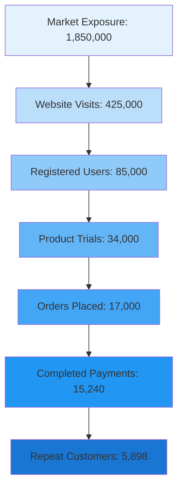
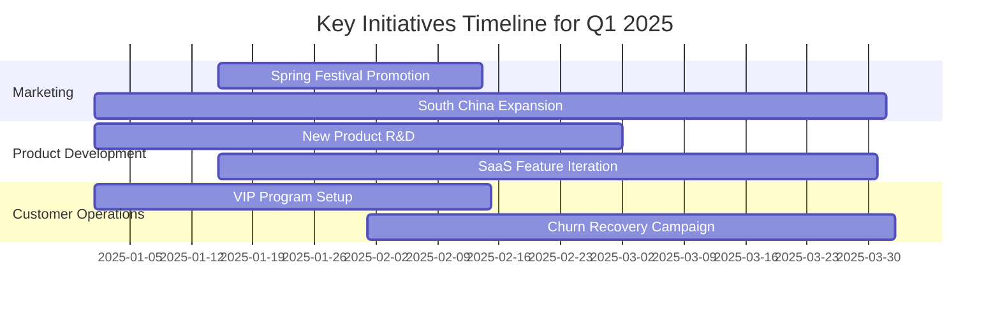

# 📊 In-Depth Analysis Report on Q4 2024 Sales Performance

Hello,

We have completed a comprehensive analysis of your company’s sales performance for the fourth quarter of 2024. Below are the detailed findings along with strategic recommendations.

## I. Core Business Metrics

Overall performance this quarter exceeded expectations. Key indicators are summarized below:

* **Total Quarterly Revenue**: ¥89.50 million (YoY +32.4%, QoQ +18.7%)
* **Total Orders**: 42,580 orders (YoY +28.1%)
* **Average Order Value (AOV)**: ¥2,102 (YoY +3.4%)
* **New Customers**: 15,240 (+41.2% YoY)
* **Repeat Purchase Rate**: 38.7% (+5.2 percentage points YoY)


```component-json {"placeholder": "Placeholder"}
{
  "type": "BarChart",
  "props": {
    "chartData": {
      "categories": ["10月", "11月", "12月", "Q4总计"],
      "seriesData": [2780, 2850, 3320, 8950]
    }
  }
}
```
---

## II. Regional Sales Performance Analysis

### 2.1 Regional Sales Contribution

From a geographic perspective, the East China region remains our primary market:

```echarts
{
  "title": {
    "text": "Q4 Revenue Share by Region",
    "left": "center"
  },
  "tooltip": {
    "trigger": "item",
    "formatter": "{b}: ¥{c}万 ({d}%)"
  },
  "legend": {
    "orient": "vertical",
    "left": "left"
  },
  "series": [{
    "type": "pie",
    "radius": ["40%", "70%"],
    "avoidLabelOverlap": false,
    "itemStyle": {
      "borderRadius": 10,
      "borderColor": "#fff",
      "borderWidth": 2
    },
    "label": {
      "show": true,
      "formatter": "{b}\n{d}%"
    },
    "data": [
      {"value": 3128, "name": "华东区", "itemStyle": {"color": "#5470c6"}},
      {"value": 2235, "name": "华南区", "itemStyle": {"color": "#91cc75"}},
      {"value": 1698, "name": "华北区", "itemStyle": {"color": "#fac858"}},
      {"value": 1164, "name": "西南区", "itemStyle": {"color": "#ee6666"}},
      {"value": 725, "name": "其他区域", "itemStyle": {"color": "#73c0de"}}
    ]
  }]
}
```

**Regional Insights**:

* East China accounts for **35%** of total revenue, maintaining its leading position, though growth has slowed (+12.3%)
* South China shows strong momentum (+45.8%), emerging as a new growth engine
* Southwest China demonstrates high potential and warrants increased investment

---

### 2.2 Monthly Revenue Trends

```echarts
{
  "title": {
    "text": "Q4 Monthly Revenue Trend (Unit: ¥10,000)",
    "left": "center"
  },
  "tooltip": {
    "trigger": "axis",
    "axisPointer": {
      "type": "cross"
    }
  },
  "legend": {
    "data": ["实际营收", "目标营收", "去年同期"],
    "bottom": 0
  },
  "grid": {
    "left": "3%",
    "right": "4%",
    "bottom": "10%",
    "containLabel": true
  },
  "xAxis": {
    "type": "category",
    "data": ["10月", "11月", "12月"]
  },
  "yAxis": {
    "type": "value",
    "name": "营收（万元）"
  },
  "series": [
    {
      "name": "实际营收",
      "type": "line",
      "data": [2780, 2850, 3320],
      "smooth": true,
      "itemStyle": {"color": "#5470c6"},
      "areaStyle": {
        "color": {
          "type": "linear",
          "x": 0, "y": 0, "x2": 0, "y2": 1,
          "colorStops": [
            {"offset": 0, "color": "rgba(84, 112, 198, 0.3)"},
            {"offset": 1, "color": "rgba(84, 112, 198, 0)"}
          ]
        }
      }
    },
    {
      "name": "目标营收",
      "type": "line",
      "data": [2600, 2700, 3000],
      "lineStyle": {"type": "dashed", "color": "#ee6666"},
      "itemStyle": {"color": "#ee6666"}
    },
    {
      "name": "去年同期",
      "type": "line",
      "data": [2100, 2150, 2500],
      "lineStyle": {"type": "dotted", "color": "#91cc75"},
      "itemStyle": {"color": "#91cc75"}
    }
  ]
}
```
**Key Findings**:

* December delivered explosive growth, exceeding targets by **10.7%**
* November underperformed slightly due to post–Singles’ Day demand softness
* Full-quarter YoY growth reached **32.4%**, indicating healthy momentum

---

## III. Product Line Analysis

### 3.1 Revenue Contribution by Product Line

```component-json {"placeholder": "Placeholder"}

{
  "type": "BarChart",
  "props": {
    "chartData": {
      "categories": ["智能硬件", "SaaS订阅", "企业定制", "技术服务", "培训咨询", "配件耗材"],
      "seriesData": [3580, 2240, 1520, 980, 420, 210]
    }
  }
}
```

### 3.2 Product Portfolio Health Assessment

A radar chart was used to evaluate the overall performance of key product lines:

```echarts
{
  "title": {
    "text": "产品线健康度雷达图",
    "left": "center"
  },
  "tooltip": {
    "trigger": "item"
  },
  "legend": {
    "data": ["智能硬件", "SaaS订阅", "企业定制"],
    "bottom": 0
  },
  "radar": {
    "indicator": [
      {"name": "市场份额", "max": 100},
      {"name": "增长率", "max": 100},
      {"name": "利润率", "max": 100},
      {"name": "客户满意度", "max": 100},
      {"name": "复购率", "max": 100},
      {"name": "客诉率", "max": 100}
    ],
    "shape": "polygon",
    "splitNumber": 5
  },
  "series": [{
    "type": "radar",
    "data": [
      {
        "value": [90, 68, 72, 88, 75, 85],
        "name": "智能硬件",
        "itemStyle": {"color": "#5470c6"},
        "areaStyle": {"opacity": 0.3}
      },
      {
        "value": [55, 95, 92, 82, 88, 90],
        "name": "SaaS订阅",
        "itemStyle": {"color": "#91cc75"},
        "areaStyle": {"opacity": 0.3}
      },
      {
        "value": [42, 78, 85, 90, 65, 88],
        "name": "企业定制",
        "itemStyle": {"color": "#fac858"},
        "areaStyle": {"opacity": 0.3}
      }
    ]
  }]
}
```


**Product Strategy Recommendations**:

1. **Smart Hardware**: Strong market leadership, but signs of slowing growth—new product launches are recommended
2. **SaaS Subscriptions**: High growth and high margins—this is a star business and should receive increased marketing and R&D investment
3. **Enterprise Customization**: Highest customer satisfaction—ideal for penetrating large enterprise accounts

---

## IV. Customer Value Analysis

### 4.1 Sales Funnel Conversion Analysis




**Conversion Metrics**:

* Exposure → Visit: **23.0%** (Industry avg: 18–22%) ✅ Exceeds expectations
* Visit → Registration: **20.0%** (Industry avg: 15–18%) ✅ Strong performance
* Registration → Trial: **40.0%** (Industry avg: 35–45%) ✅ On target
* Trial → Order: **50.0%** (Industry avg: 40–50%) ✅ Upper bound
* Order → Payment: **89.6%** (Industry avg: 75–85%) 🔥 Significantly above average
* Payment → Repeat Purchase: **38.7%** (Industry avg: 25–35%) 🔥 Outstanding

**Optimization Recommendation**:

* While performance is strong across all stages, the **registration-to-trial** step still has ~10% upside
* Simplifying the trial onboarding process is recommended

---

### 4.2 RFM Customer Segmentation

Based on the RFM model, customers were segmented as follows:

```echarts
{
  "title": {
    "text": "RFM Customer Value Distribution",
    "left": "center"
  },
  "tooltip": {
    "trigger": "axis",
    "axisPointer": {
      "type": "shadow"
    }
  },
  "legend": {
    "data": ["客户数", "贡献营收"],
    "bottom": 0
  },
  "grid": {
    "left": "3%",
    "right": "4%",
    "bottom": "10%",
    "containLabel": true
  },
  "xAxis": {
    "type": "category",
    "data": ["重要价值", "重要发展", "重要保持", "一般价值", "流失预警"]
  },
  "yAxis": [
    {
      "type": "value",
      "name": "客户数",
      "position": "left"
    },
    {
      "type": "value",
      "name": "营收（万元）",
      "position": "right"
    }
  ],
  "series": [
    {
      "name": "客户数",
      "type": "bar",
      "data": [1840, 3560, 4280, 4950, 610],
      "itemStyle": {"color": "#5470c6"}
    },
    {
      "name": "贡献营收",
      "type": "line",
      "yAxisIndex": 1,
      "data": [3580, 2680, 1790, 720, 180],
      "itemStyle": {"color": "#ee6666"}
    }
  ]
}
```

**Customer Operation Strategies**:

* **High-Value Customers (1,840)**: Provide VIP services with dedicated Customer Success Managers
* **Growth-Potential Customers (3,560)**: Strengthen product education to encourage deeper usage
* **Retention-Focused Customers (4,280)**: Conduct regular follow-ups to prevent churn
* **At-Risk Customers (610)**: Launch win-back programs and analyze churn drivers

---

### 4.3 Customer Lifetime Value (CLV) Projection

We built a CLV prediction model based on historical data:

$$
CLV = \sum_{t=1}^{n} \frac{R_t - C_t}{(1 + d)^{t-1}}
$$

Where:
- $R_t$ = revenue in period $t$
- $C_t$ = cost in period $t$
- $d$ = discount rate (12%)
- $n$ = customer lifetime

Average CLV by segment:

$$
\begin{align}
CLV_{\text{High Value}} &= ¥19,456 \\
CLV_{\text{Growth Potential}} &= ¥7,532 \\
CLV_{\text{Retention}} &= ¥4,183 \\
CLV_{\text{General}} &= ¥1,455
\end{align}
$$

**ROI Insights**:

* Average CAC: ¥420
* LTV/CAC for high-value customers reaches **46.3**, far exceeding the healthy benchmark of 3:1
* Recommendation: increase acquisition investment targeting high-value segments

---

## V. Competitive Benchmarking

```echarts
{
  "title": {
    "text": "Market Share Comparison with Key Competitors",
    "left": "center"
  },
  "tooltip": {
    "trigger": "axis",
    "axisPointer": {
      "type": "shadow"
    }
  },
  "legend": {
    "data": ["Q3市场份额", "Q4市场份额"],
    "bottom": 0
  },
  "grid": {
    "left": "3%",
    "right": "4%",
    "bottom": "10%",
    "containLabel": true
  },
  "xAxis": {
    "type": "value",
    "max": 100,
    "axisLabel": {
      "formatter": "{value}%"
    }
  },
  "yAxis": {
    "type": "category",
    "data": ["我司", "竞品A", "竞品B", "竞品C", "其他"]
  },
  "series": [
    {
      "name": "Q3市场份额",
      "type": "bar",
      "data": [18.5, 24.2, 19.8, 15.3, 22.2],
      "itemStyle": {"color": "#91cc75"}
    },
    {
      "name": "Q4市场份额",
      "type": "bar",
      "data": [21.3, 23.1, 18.7, 14.8, 22.1],
      "itemStyle": {"color": "#5470c6"}
    }
  ]
}
```

**Competitive Landscape**:

* Market share increased from **18.5% to 21.3%**, a gain of 2.8 percentage points
* Successfully surpassed Competitor B, ranking **second** in the industry
* Gap with the market leader (Competitor A) narrowed to **1.8 percentage points**

---

## VI. Action Plan for Q1 2025

### 6.1 Marketing Strategy

1. **South China Market Expansion**

   * Budget: ¥1.8 million
   * Target: 40% growth
   * Actions: establish a regional operations center and recruit local teams

2. **Product Portfolio Optimization**

   * SaaS: introduce annual subscription discounts to increase LTV
   * Smart Hardware: launch next-generation products targeting the Spring Festival
   * Enterprise Customization: initiate dedicated large-account campaigns

3. **Customer Segmentation Operations**

   * High-value customers: dedicated CSMs (1:50 ratio)
   * At-risk customers: 90-day retention recovery program

---

### 6.2 Operational Efficiency Improvement



### 6.3 Key KPI Targets

| Metric                  | Q4 Actual | Q1 Target | Growth  |
| ----------------------- | --------- | --------- | ------- |
| Revenue (¥10,000)       | 8,950     | 10,200    | +14.0%  |
| New Customers           | 15,240    | 17,500    | +14.8%  |
| Repeat Purchase Rate    | 38.7%     | 42.0%     | +3.3 pp |
| Average Order Value (¥) | 2,102     | 2,250     | +7.0%   |
| Gross Margin            | 48.2%     | 50.0%     | +1.8 pp |

---

## VII. Risks & Mitigation

⚠️ **Key Risks to Monitor**:

1. **Market Risk**

   * February sales dip due to Spring Festival (historical avg: −22%)
   * Mitigation: inventory preparation and stronger marketing in January & March

2. **Competitive Risk**

   * Potential price war initiated by Competitor A
   * Mitigation: reinforce differentiation and avoid pure price competition

3. **Supply Chain Risk**

   * Extended lead times for certain core components
   * Mitigation: early stocking and secondary supplier development

---

## Conclusion

Q4 2024 delivered outstanding results, **exceeding targets with 32.4% YoY growth**.

✅ **Strengths**:

* Conversion rates significantly outperform industry benchmarks
* Rising repeat purchase rate, indicating stronger customer loyalty
* Expanded market share and improved competitive positioning

⚠️ **Areas for Improvement**:

* Sluggish AOV growth, indicating limited pricing power
* Uneven regional development
* Further room to reduce churn

🎯 **Strategic Focus for 2025**:

* Deepen engagement with high-value customers to maximize CLV
* Accelerate expansion in South China
* Shift product mix toward higher-margin offerings

If you have any questions or require deeper analysis on specific areas, please feel free to reach out.