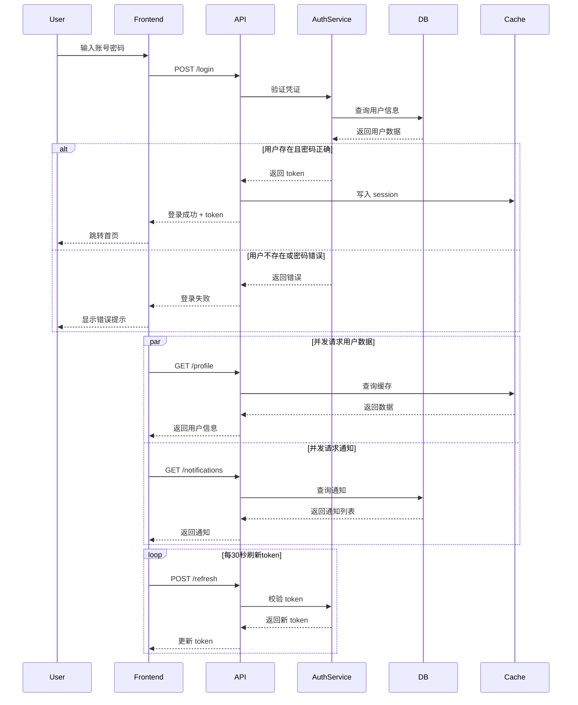

```ts
mermaid: {
  renderer: MermaidRenderer,
}
```



```component-json {"placeholder": "Placeholder"}
{"type":"BarChart","props":{"chartData":{"categories":["type1","type2","type3","type4","type5","type6","type7","type8","type9","type10","type11","type12","type13","type14","type15","type16","type17","type18","type19","type20"],"seriesData":[100,200,150,180,120,130,170,160,190,210,220,140,125,155,165,175,185,195,205,215]}}}
```
aaa

From a geographic perspective, the East China region remains our primary market:

```echarts
{
  "title": {
    "text": "Q4 Revenue Share by Region",
    "left": "center"
  },
  "tooltip": {
    "trigger": "item",
    "formatter": "{b}: ¥{c}万 ({d}%)"
  },
  "legend": {
    "orient": "vertical",
    "left": "left"
  },
  "series": [{
    "type": "pie",
    "radius": ["40%", "70%"],
    "avoidLabelOverlap": false,
    "itemStyle": {
      "borderRadius": 10,
      "borderColor": "#fff",
      "borderWidth": 2
    },
    "label": {
      "show": true,
      "formatter": "{b}\n{d}%"
    },
    "data": [
      {"value": 3128, "name": "华东区", "itemStyle": {"color": "#5470c6"}},
      {"value": 2235, "name": "华南区", "itemStyle": {"color": "#91cc75"}},
      {"value": 1698, "name": "华北区", "itemStyle": {"color": "#fac858"}},
      {"value": 1164, "name": "西南区", "itemStyle": {"color": "#ee6666"}},
      {"value": 725, "name": "其他区域", "itemStyle": {"color": "#73c0de"}}
    ]
  }]
}
```


```ts
createMarkdownRenderer({
  mermaid: { renderer },
  echart: { renderer },
  codeBlock: { renderer },
});
```

### 2. Capability-based Rendering

Each feature is **opt-in**:

| Feature        | Config Key                        |
| -------------- | --------------------------------- |
| Code blocks    | `codeBlock`                       |
| Mermaid        | `mermaid`                         |
| ECharts        | `echart`                          |
| Vue components | `componentsMap`                   |
| LaTeX          | `remarkPlugins` / `rehypePlugins` |


## Raw HTML

<div class='text'>1111</div>
<div style='color: red'>1111</div>
<div>1111</div>

## Prevent-XSS

[危险链接](<javascript:alert('xss')>)

<script>alert('XSS-script')</script>

<iframe src="javascript:alert('XSS-iframe')"></iframe>