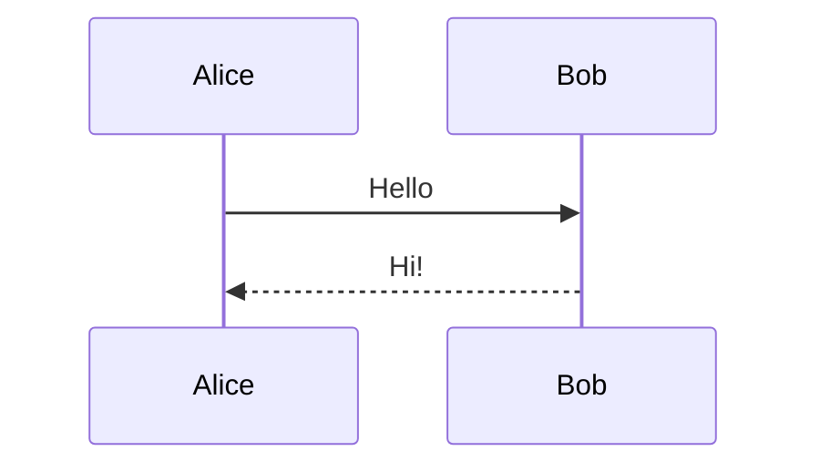

<think>
VueMarkdownRenderer is a high-performance Vue.js Markdown component built for modern web applications. It leverages Vue's virtual DOM to efficiently update the DOM, ensuring smooth rendering even for complex Markdown content.

The component features Shiki-powered syntax highlighting with support for both light and dark themes. It integrates seamlessly with Vue, allowing dynamic rendering of components through `component-json` code blocks, and provides support for visualizing ECharts options via `echarts` code blocks.

For mathematical content, VueMarkdownRenderer supports LaTeX through remark-math and rehype-katex plugins. Additionally, it offers a flexible codeBlockRenderer prop, giving developers full control over how specific code blocks are rendered, including access to the highlighted vnode and language information.

Overall, VueMarkdownRenderer combines flexibility, performance, and rich feature support to create interactive, readable, and visually appealing Markdown content in Vue applications.
</think>

# VueMarkdownRenderer

A **config-driven**, high-performance Markdown renderer for Vue, designed for **LLM streaming**, **rich code blocks**, and **embedded visual components**.

[live demo](https://linzhe141.github.io/vue-markdown-renderer/)

---

## Core Idea

Unlike traditional Markdown components that rely on many reactive props,
**VueMarkdownRenderer uses a single static configuration to define rendering behavior**.

```ts
const MarkdownRenderer = createMarkdownRenderer(config);
```

* Rendering capabilities are defined **once**
* The returned renderer component is **pure and predictable**
* Avoids the mental overhead of “is this prop reactive?”

This design is intentional:
**99% of Markdown rendering scenarios do not require runtime mutation of render rules.**

---

## Installation

```bash
npm install vue-mdr
```

---

## Basic Usage

```ts
import { createMarkdownRenderer } from "vue-mdr";
```

```ts
export const MarkdownRenderer = createMarkdownRenderer({
  // configuration here
});
```

```vue
<template>
  <MarkdownRenderer :source="markdownText" />
</template>
```

---

## Full Configuration Example

Below is a **complete example** matching the latest API design.

```ts
import { createMarkdownRenderer } from "vue-mdr";

import "katex/dist/katex.min.css";
import remarkMath from "remark-math";
import rehypeKatex from "rehype-katex";
import type { Plugin } from "unified";

import {
  BarChart,
  CodeBlockRenderer,
  MermaidRenderer,
  EchartRenderer,
  Placeholder,
} from "./components";

export const MarkdownRenderer = createMarkdownRenderer({
  /**
   * Custom Vue components rendered via `component-json` blocks
   */
  componentsMap: {
    BarChart,
    Placeholder,
  },

  /**
   * Custom code block renderer
   */
  codeBlock: {
    renderer: CodeBlockRenderer,
  },

  /**
   * ECharts support
   */
  echart: {
    renderer: EchartRenderer,
    placeholder: Placeholder,
  },

  /**
   * Mermaid diagrams
   */
  mermaid: {
    renderer: MermaidRenderer,
  },

  /**
   * Markdown / HTML plugins
   */
  remarkPlugins: [remarkMath],
  rehypePlugins: [rehypeKatex as unknown as Plugin],
});
```

---

## Design Philosophy

### 1. Static Configuration over Reactive Props

```ts
createMarkdownRenderer({
  mermaid: { renderer },
  echart: { renderer },
  codeBlock: { renderer },
});
```

* No runtime mutation
* No watchers
* No ambiguous reactivity expectations

> The renderer is **configured**, not **controlled**.

---

### 2. Capability-based Rendering

Each feature is **opt-in**:

| Feature        | Config Key                        |
| -------------- | --------------------------------- |
| Code blocks    | `codeBlock`                       |
| Mermaid        | `mermaid`                         |
| ECharts        | `echart`                          |
| Vue components | `componentsMap`                   |
| LaTeX          | `remarkPlugins` / `rehypePlugins` |

If you don’t configure it, it doesn’t exist.

---

## Custom Code Block Rendering

Your `CodeBlockRenderer` receives:

```ts
interface Props {
  highlightVnode: VNode;
  language: string;
}
```

This allows you to implement:

* Copy buttons
* Language labels
* Custom headers
* Animations
* Streaming-friendly UI

```ts
codeBlock: {
  renderer: CodeBlockRenderer,
}
```

---

## Rendering Vue Components (`component-json`)

````markdown
```component-json {"placeholder": "Placeholder"}
{
  "type": "BarChart",
  "props": {
    "chartData": {
      "categories": ["A", "B", "C"],
      "seriesData": [10, 20, 30]
    }
  }
}
```
````

```component-json {"placeholder": "Placeholder"}
{"type":"BarChart","props":{"chartData":{"categories":["type1","type2","type3","type4","type5","type6","type7","type8","type9","type10","type11","type12","type13","type14","type15","type16","type17","type18","type19","type20"],"seriesData":[100,200,150,180,120,130,170,160,190,210,220,140,125,155,165,175,185,195,205,215]}}}
```
## Rendering ECharts

````markdown
```echarts
{
  "title": {
    "text": "数据对比趋势变化",
    "left": "center"
  },
  "tooltip": {
    "trigger": "axis",
    "axisPointer": {
      "type": "cross",
      "crossStyle": { "color": "#999" }
    },
    "formatter": "{b}<br/>{a0}: {c0}"
  },
  "legend": {
    "data": ["本期"],
    "top": "bottom"
  },
  "grid": {
    "left": "3%",
    "right": "4%",
    "bottom": "10%",
    "containLabel": true
  },
  "xAxis": [
    {
      "type": "category",
      "data": ["xxx", "zzz"],
      "axisPointer": { "type": "shadow" }
    }
  ],
  "yAxis": [
    {
      "type": "value",
      "name": "数值",
      "min": 0,
      "axisLabel": { "formatter": "{value}" }
    }
  ],
  "series": [
    {
      "name": "本期",
      "type": "bar",
      "data": [5061.1429, 504.8844],
      "itemStyle": { "color": "#3ba272" }
    }
  ]
}
```
````

Configuration:

```ts
echart: {
  renderer: EchartRenderer,
  placeholder: Placeholder,
}
```
```echarts
{
  "title": {
    "text": "数据对比趋势变化",
    "left": "center"
  },
  "tooltip": {
    "trigger": "axis",
    "axisPointer": {
      "type": "cross",
      "crossStyle": { "color": "#999" }
    },
    "formatter": "{b}<br/>{a0}: {c0}"
  },
  "legend": {
    "data": ["本期"],
    "top": "bottom"
  },
  "grid": {
    "left": "3%",
    "right": "4%",
    "bottom": "10%",
    "containLabel": true
  },
  "xAxis": [
    {
      "type": "category",
      "data": ["xxx", "zzz"],
      "axisPointer": { "type": "shadow" }
    }
  ],
  "yAxis": [
    {
      "type": "value",
      "name": "数值",
      "min": 0,
      "axisLabel": { "formatter": "{value}" }
    }
  ],
  "series": [
    {
      "name": "本期",
      "type": "bar",
      "data": [5061.1429, 504.8844],
      "itemStyle": { "color": "#3ba272" }
    }
  ]
}
```

---

## Mermaid Diagrams

````markdown

````

```ts
mermaid: {
  renderer: MermaidRenderer,
}
```

---

## LaTeX Support

```ts
remarkPlugins: [remarkMath],
rehypePlugins: [rehypeKatex],
```

$$
\begin{align}
\nabla \times \vec{\mathbf{B}} -\, \frac1c\, \frac{\partial\vec{\mathbf{E}}}{\partial t} & = \frac{4\pi}{c}\vec{\mathbf{j}} \\
\nabla \cdot \vec{\mathbf{E}} & = 4 \pi \rho \\
\nabla \times \vec{\mathbf{E}}\, +\, \frac1c\, \frac{\partial\vec{\mathbf{B}}}{\partial t} & = \vec{\mathbf{0}} \\
\nabla \cdot \vec{\mathbf{B}} & = 0
\end{align}
$$

