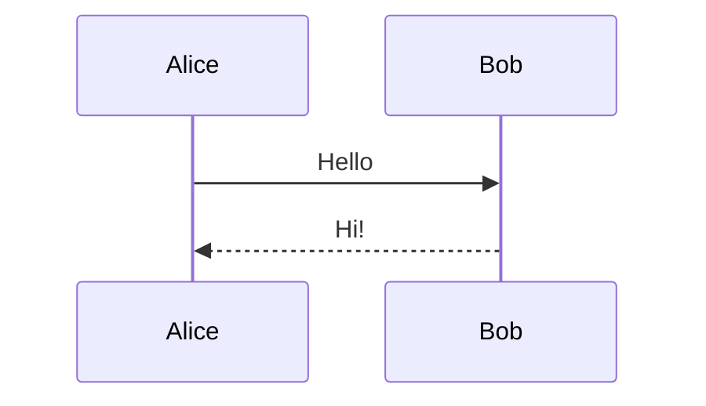

<think>
This playground now follows the latest API shape directly.

The key idea is that renderer configuration lives in three stable zones:
- renderers
- plugins
- processor

That separation keeps the mental model clean:
- renderers decide how nodes and rich blocks become Vue output
- plugins extend the markdown pipeline
- processor controls lower-level transforms and safety behavior

Streaming is still handled outside the renderer. The playground keeps chunk pre-parsing untouched and only feeds the renderer completed text segments.
</think>

# VueMarkdownRenderer

A config-driven Markdown renderer for Vue, designed for streaming UIs, rich code blocks, and custom node rendering.

[live demo](https://linzhe141.github.io/vue-markdown-renderer/)


## What Changed

The API is now intentionally grouped:

```ts
const MarkdownRenderer = createMarkdownRenderer({
  renderers: {},
  plugins: {},
  processor: {},
});
```

This structure is meant to be stable:

- `renderers` controls how tags, tables, code blocks, Mermaid, ECharts, and `component-json` blocks render
- `plugins` collects the markdown pipeline extensions in one place
- `processor` holds lower-level conversion and sanitize options

## Recommended Playground Setup

```ts
import { createMarkdownRenderer } from "vue-mdr";

import "katex/dist/katex.min.css";
import rehypeKatex from "rehype-katex";
import remarkMath from "remark-math";
import type { Plugin } from "unified";

import {
  BarChart,
  CodeBlockRenderer,
  EchartRenderer,
  MermaidRenderer,
  Placeholder,
  TableRenderer,
} from "./components";
import ARenderer from "./nodes/ARenderer.vue";
import CodeRender from "./nodes/CodeRender.vue";
import ImageRenderer from "./nodes/ImageRenderer.vue";
import PRender from "./nodes/PRender.vue";

export const MarkdownRenderer = createMarkdownRenderer({
  renderers: {
    nodes: {
      a: ARenderer,
      img: ImageRenderer,
      p: PRender,
      code: CodeRender,
    },
    components: {
      BarChart,
      Placeholder,
    },
    codeBlock: CodeBlockRenderer,
    echart: {
      renderer: EchartRenderer,
      placeholder: Placeholder,
    },
    mermaid: MermaidRenderer,
    table: TableRenderer,
  },
  plugins: {
    remark: [remarkMath],
    rehype: [rehypeKatex as unknown as Plugin],
  },
  processor: {
    remarkRehype: {
      allowDangerousHtml: true,
    },
    sanitizeSchema: {
      attributes: {
        "*": ["className", "style"],
      },
    },
  },
});
```

## Why This API Holds Up

```ts
createMarkdownRenderer({
  renderers: {
    nodes: { a: LinkRenderer },
    codeBlock: FancyCodeBlock,
  },
  plugins: {
    remark: [remarkMath],
  },
  processor: {
    sanitizeSchema: {
      attributes: {
        "*": ["className"],
      },
    },
  },
});
```

- Static configuration stays easy to reason about
- Custom node rendering has a single extension point
- Built-in rich blocks still work without leaking pipeline details
- Playground examples now mirror the intended public API exactly

## Capability Map

| Use case | Recommended key |
| --- | --- |
| Override HTML or custom hast tags | `renderers.nodes` |
| Register `component-json` targets | `renderers.components` |
| Replace code block chrome | `renderers.codeBlock` |
| Mermaid diagrams | `renderers.mermaid` |
| ECharts blocks | `renderers.echart` |
| Custom table presentation | `renderers.table` |
| Markdown / rehype extensions | `plugins.remark` / `plugins.rehype` |
| Rehype bridge / sanitize details | `processor` |

## Custom Code Block Renderer

Your `CodeBlockRenderer` receives:

```ts
interface Props {
  highlightVnode: VNode;
  language: string;
  code: string;
}
```

That makes it straightforward to build:

- Copy actions
- Language badges
- File labels
- Streaming-aware code frames

## Node Renderer Example

The new API makes tag overrides a first-class concept:

```ts
renderers: {
  nodes: {
    a: ARenderer,
    img: ImageRenderer,
    p: PRender,
    code: CodeRender,
  },
}
```

Custom node renderers are a good fit when you want a consistent visual layer without changing the markdown content itself.

## Rendering Vue Components with `component-json`

````markdown
```component-json {"placeholder": "Placeholder"}
{
  "type": "BarChart",
  "props": {
    "chartData": {
      "categories": ["A", "B", "C"],
      "seriesData": [10, 20, 30]
    }
  }
}
```
````

```component-json {"placeholder": "Placeholder"}
{"type":"BarChart","props":{"chartData":{"categories":["type1","type2","type3","type4","type5","type6","type7","type8","type9","type10","type11","type12","type13","type14","type15","type16","type17","type18","type19","type20"],"seriesData":[100,200,150,180,120,130,170,160,190,210,220,140,125,155,165,175,185,195,205,215]}}}
```

## Rendering ECharts

````markdown
```echarts
{
  "title": {
    "text": "Streaming Throughput by Region",
    "left": "center"
  },
  "tooltip": {
    "trigger": "axis",
    "axisPointer": {
      "type": "cross",
      "crossStyle": { "color": "#999" }
    }
  },
  "legend": {
    "data": ["requests/min"],
    "top": "bottom"
  },
  "grid": {
    "left": "3%",
    "right": "4%",
    "bottom": "10%",
    "containLabel": true
  },
  "xAxis": [
    {
      "type": "category",
      "data": ["US-East", "Singapore"],
      "axisPointer": { "type": "shadow" }
    }
  ],
  "yAxis": [
    {
      "type": "value",
      "name": "rpm",
      "min": 0,
      "axisLabel": { "formatter": "{value}" }
    }
  ],
  "series": [
    {
      "name": "requests/min",
      "type": "bar",
      "data": [506, 728],
      "itemStyle": { "color": "#2563eb" }
    }
  ]
}
```
````

Recommended configuration:

```ts
renderers: {
  echart: {
    renderer: EchartRenderer,
    placeholder: Placeholder,
  },
}
```

```echarts
{
  "title": {
    "text": "Streaming Throughput by Region",
    "left": "center"
  },
  "tooltip": {
    "trigger": "axis",
    "axisPointer": {
      "type": "cross",
      "crossStyle": { "color": "#999" }
    }
  },
  "legend": {
    "data": ["requests/min"],
    "top": "bottom"
  },
  "grid": {
    "left": "3%",
    "right": "4%",
    "bottom": "10%",
    "containLabel": true
  },
  "xAxis": [
    {
      "type": "category",
      "data": ["US-East", "Singapore"],
      "axisPointer": { "type": "shadow" }
    }
  ],
  "yAxis": [
    {
      "type": "value",
      "name": "rpm",
      "min": 0,
      "axisLabel": { "formatter": "{value}" }
    }
  ],
  "series": [
    {
      "name": "requests/min",
      "type": "bar",
      "data": [506, 728],
      "itemStyle": { "color": "#2563eb" }
    }
  ]
}
```

## Mermaid Diagrams

````markdown

```mermaid
sequenceDiagram
  Alice->>Bob: Hello
  Bob-->>Alice: Hi!
```
````

```ts
renderers: {
  mermaid: MermaidRenderer,
}
```


```mermaid
sequenceDiagram
  Alice->>Bob: Hello
  Bob-->>Alice: Hi!
```

## Tables

| Layer | Responsibility | Why it matters |
| --- | --- | --- |
| `renderers` | Vue-facing rendering decisions | Keeps visuals explicit |
| `plugins` | Unified pipeline extensions | Keeps markdown transforms composable |
| `processor` | Rehype bridge and sanitize details | Keeps internals grouped |

## LaTeX Support

```ts
plugins: {
  remark: [remarkMath],
  rehype: [rehypeKatex],
}
```

$$
\begin{align}
\nabla \times \vec{\mathbf{B}} -\, \frac1c\, \frac{\partial\vec{\mathbf{E}}}{\partial t} & = \frac{4\pi}{c}\vec{\mathbf{j}} \\
\nabla \cdot \vec{\mathbf{E}} & = 4 \pi \rho \\
\nabla \times \vec{\mathbf{E}}\, +\, \frac1c\, \frac{\partial\vec{\mathbf{B}}}{\partial t} & = \vec{\mathbf{0}} \\
\nabla \cdot \vec{\mathbf{B}} & = 0
\end{align}
$$

## Raw HTML and Sanitization

<div class='text'>block with className</div>
<div style='color: red'>block with inline style</div>
<div>plain block</div>

## XSS Prevention

[Dangerous Link](<javascript:alert('xss')>)

<script>alert('XSS-script')</script>

<iframe src="javascript:alert('XSS-iframe')"></iframe>
